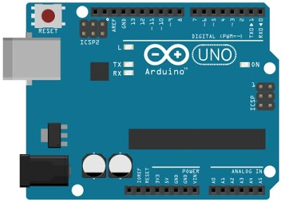

# 1.Arduinoとは

Arduino（アルデュイーノ）とは、AVRマイコン、入出力ポートを備えた基板、C言語風のArduino言語とそれの統合開発環境から構成されるシステムです。
 
はんだ付け無しでも使える、PCと繋ぐだけで動くなど、手軽に電子工作が行えます。
 
光、温度、音などのセンサーにより周囲の情報を感知し、LED点灯、音声出力、モーターを動かすなど様々なことができます。

実際にArduinoを使用して作られたものをいくつか紹介します。

水がこぼれない車載テーブル
 
https://www.youtube.com/watch?v=-q7pv8vKH68

ロボットアーム
 
https://www.youtube.com/watch?v=WWRsUM4U5cc

LED Arduino Clock
 
https://www.youtube.com/watch?v=q4RwP0UK8gM

Arduino Wireless Animatronic Hand
 
https://www.youtube.com/watch?v=ZYKoNi48m9o#t=213

Arduinoには現在17種類がのバージョンがあり、今回はその中の「Arduino　Uno」を使用します。

