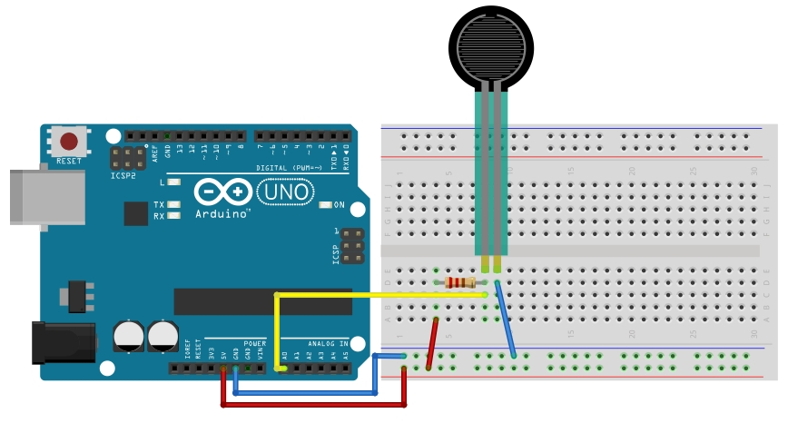
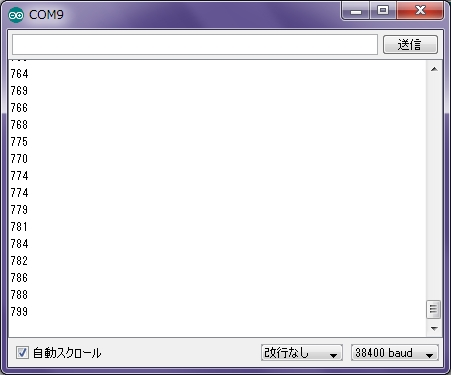

# 10.感圧センサー

## センサー


感圧センサーはFSR402を使います。
<br>
http://akizukidenshi.com/catalog/g/gP-04002/

## 回路




## スケッチ

```
int pin    = 0;  //センサーのピン番号
int get_a0 = 0;  //センサーデータ取得用

void setup(){
  Serial.begin(38400);
}

void loop()                     
{
  get_a0 = analogRead(pin); // 感圧センサーからデータを取得
  Serial.println(get_a0);   // シリアルモニタに出力
  delay(200);
}
```

## 動作確認
シリアルモニタを開き、センサーの値を確認します。
<br>
通常は1000程度ですが、指でつまんで力を入れると数値が下がっていきます。
<br>

