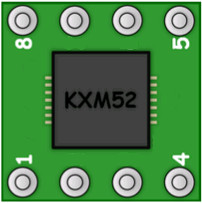
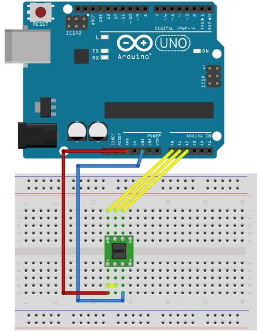

# 11.3軸加速度センサー

## センサー



３軸加速度センサーとは、XYZの３軸の加速度を取得することができるセンサーです。

ここでは加速度センサーはKXM52、またはKXR94を使います。

KXM52
<br>
http://akizukidenshi.com/download/aki-3axis-module.pdf

KXR94
<br>
http://akizukidenshi.com/download/ds/akizuki/AKI-KXR94-Module.pdf

## 回路

センサーには向きがありますので注意しましょう。
左下に「１」と書かれた部分がくるように設置します。
<br>


## スケッチ

```
int outX = 2;  // X軸のピン番号
int outY = 1;  // Y軸のピン番号
int outZ = 0;  // Z軸のピン番号

void setup(){
  Serial.begin(38400) ; 
}

void loop(){
  // それぞれの軸のデータを取得
  int valX = analogRead(outX); 
  int valY = analogRead(outY);
  int valZ = analogRead(outZ);
  
  // シリアルモニタへ出力
  Serial.print("X("); 
  Serial.print(valX); 
  Serial.print("),  Y("); 
  Serial.print(valY); 
  Serial.print("),  Z("); 
  Serial.print(valZ);  
  Serial.println(")"); 

  delay(300) ;  
}
```

## 動作確認

書き込みが完了しましたら、ブレッドボードを持って傾けたり移動したりして、シリアルモニタの数値が変化することを確認してみましょう。