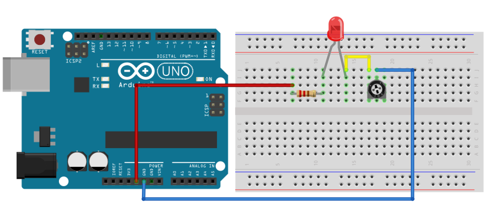
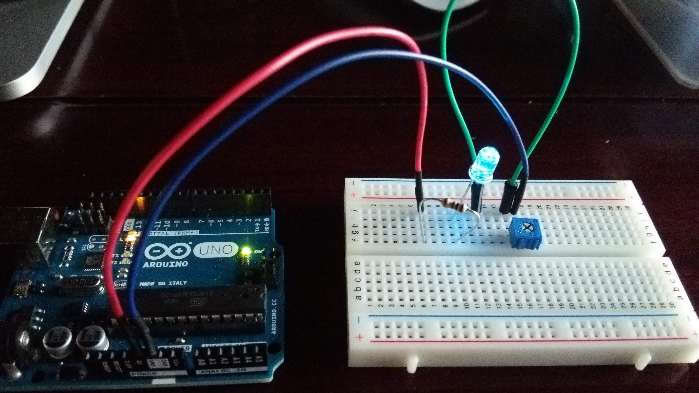
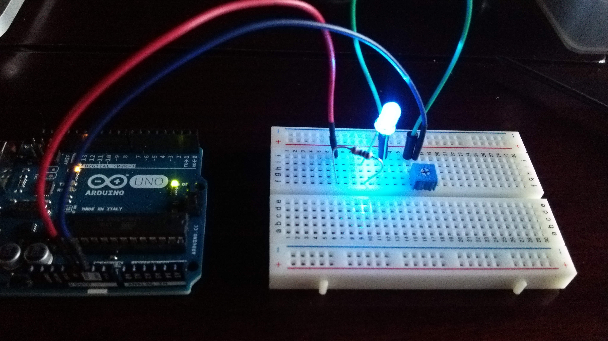
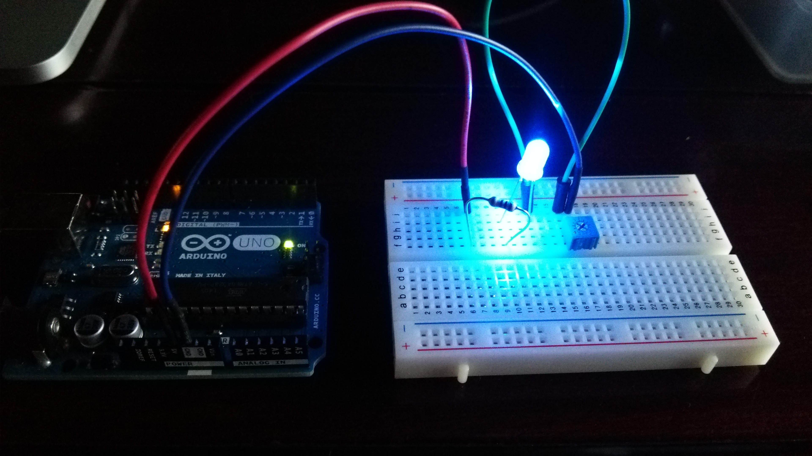
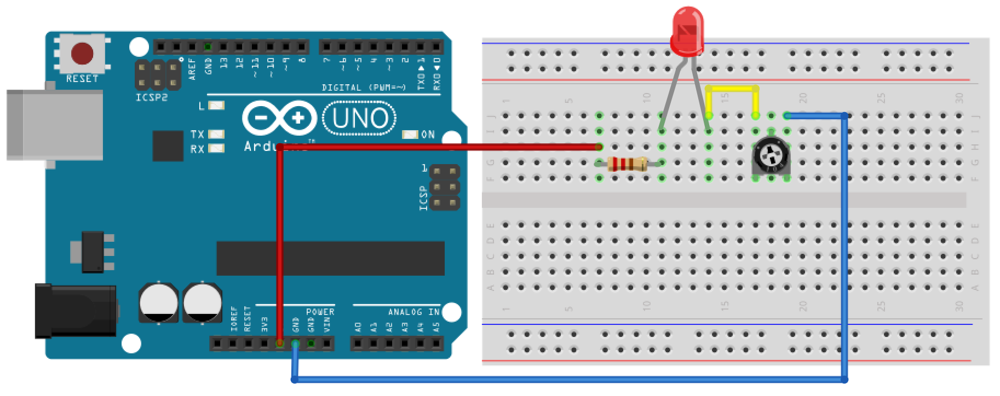
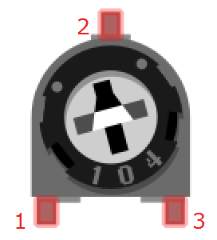
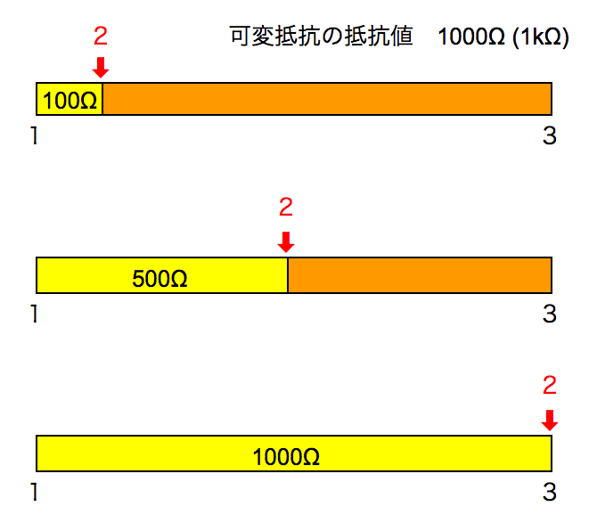
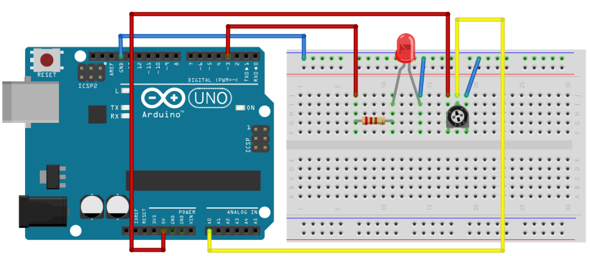

# 13．可変抵抗

## 可変抵抗


可変抵抗とは、ボリュームを変更することにより抵抗値を変更できる抵抗です。

今回は反固定ボリューム103(10kΩ)を使用します。
<br>
http://akizukidenshi.com/catalog/g/gP-03277/

上の図は「104」となっていますが、今回は「103」を使用します。
<br>
この数値は抵抗の値を表しています。
104は10×104で100000Ω=100kΩ、103は10×103Ω=10kΩとなります。

## LEDの明るさ変更


一旦回路を作成してみましょう。
可変抵抗から接続するのは左から１、２番目です。
<br>



今回はプログラムを使用せずに動作させるため、回路ができましたら、PCに接続してみましょう。
LEDが点きましたら可変抵抗のボリュームを変更し、LEDの光り方に変化があることを確認します。

時計回りで最大までまわした状態
<br>


反時計回りに少しまわした状態
<br>

 

反時計回りに最大までまわした状態
<br>


今度は可変抵抗の左から１、３番目を接続してみます。
<br>


できましたらPCに接続し、ボリュームを変更してみましょう。

 

可変抵抗はボリュームを変更すると抵抗が変わりますが、上の図の１から3間の抵抗値は一定となります。
変更されるのは１から２、２から３の間となります。

 

## プログラムによるLEDの明るさ変更


可変抵抗の値を取得し、取得した値でLEDの明るさを変更してみましょう。

### 回路

回路を作成するのですが、ここで注意しないといけないのがデジタルピンの番号です。
数字の隣に「〜」がついているものを選びましょう。
この「〜」がついている番号のみアナログ出力(PWM出力)が行えます。
<br>
 


### スケッチ

回路ができましたらスケッチしてみましょう。
```
int ledPin = 3;     // 3番ピンのLED
int analogPin = 0;  // A0の可変抵抗
int val = 0;

void setup() {
  Serial.begin(9600);
}

void loop() {
  // A0ピンより可変抵抗の値(アナログデータ)を取得
  val = analogRead(analogPin);
  // 得たアナログ値を1/4して、0〜1023の値を0〜255に変換
  analogWrite(ledPin, val / 4);
  Serial.println(val/4);
  delay(100);
}
```

analogReadにて取得できる値は0〜1023になります。
<br>
analogWriteでは0から255までの範囲のみ出力できるので、取得データを4分の1にして出力しています。


PCに接続し、書き込み後に可変抵抗を変更してみましょう。

## ブザーの音量を変更してみよう

可変抵抗は以前使用したブザーの音の大きさを変更することもできます。
<br>
時間がある場合はやってみてください。

ブザーを使用する場合、下のリンク先をご参照下さい。
<br>
なお、tone関数自体では音量を変更できないため、直接抵抗を変更させる方法(プログラムではない方)で行います。