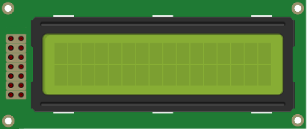

# 14．LCD

## LCD

<br>
LCD(リキッドクリスタルディスプレイ)は液晶ディスプレイです。


今回使用するのはＬＣＤキャラクタディスプレイモジュールです。
<br>
半角の16文字を2行出力することができます。
<br>
http://akizukidenshi.com/catalog/g/gP-00040/

１６文字を２行分表示することができます。
今回使用するものはバックライト無しですが、ある程度の明るさがあれば問題なく見れると思います。


LCDのピンは下の図のような順で番号が振ってあります。
 

LCD側のそれぞれのピンと、Arduino側の接続先について説明をします。
ピンの並び順に記述します。
今回の◯番ピンというのは全てデジタルのピンになります。

| No|内容|接続先||No|内容| 接続先|
|--|--|--|--|--|--|--|
|14|入出力(DB7)|7番ピン||13|入出力(DB6)|6番ピン|
|12|入出力(DB5)|5番ピン||11|入出力(DB4)|4番ピン|
|10|入出力(DB3)|接続無し||9|入出力(DB2)|接続無し|
|8|入出力(DB1)|接続無し||7|入出力(DB0)|接続無し|
|6|入力(E)|3番ピン||5|入力(R/W)|2番ピン|
|4|入力(RS)|1番ピン||3|ｺﾝﾄﾗｽﾄ調整(Vo| 9番ピン|
|2|電源(VSS)|GND||1|電源(Vdd)|５v|

## 回路

それでは回路を作成してみましょう。
<br>
1を5v、2をGND、3を9番ピンにつけましたら、その後は1番ピンから順に接続していきます。
<br>
7〜10番ピンは使用しませんので空けておいて問題ありません。
<br>
9番ピンに接続したコントラスト調整ですが、これはアナログデータ出力になるので「〜」が表示されているピンを使用します。
<br>


## スケッチ

次にスケッチですが、今回はサンプルを使ってみたいと思います。
<br>
[ファイル]→[スケッチの例]→[LiquidCrystal]→[HelloWorld]を選択します。

下のスケッチはサンプルのコメントを除外し、説明文を追加しています。

```
// LCDを使う場合に必要なファイルを読み込む
#include <LiquidCrystal.h>

// LCD表示に使用するピン番号を指定
LiquidCrystal lcd(12, 11, 5, 4, 3, 2);


void setup() {
 // LCDの出力範囲指定(16文字を2行表示)
 lcd.begin(16, 2);
 // LCDに文字を出力
 lcd.print("hello, world!");
}

void loop() {
 // LCDの出力位置設定(2行目の1番目に設定)
 lcd.setCursor(0, 1);
 // 処理開始からの秒数を表示
 lcd.print(millis()/1000);
}
```

このサンプルのLiquidCrystal lcdの部分を変更します。
```
LiquidCrystal lcd(12, 11, 5, 4, 3, 2);
```


変更後
```
LiquidCrystal lcd(1, 2, 3, 4, 5, 6, 7);

```

このサンプルは可変抵抗によってコントラストを変更することが前提になっています。
今回の回路では可変抵抗を使用していないので、コントラストの値をスケッチで指定します。
void setup()内に下の文を追加して下さい。
```
    // コントラスト設定  9番ピンに70を設定
    analogWrite(9, 70);

```
この70の値を下げれば濃くなり、上げれば薄くなります。
変更が完了しましたら、書き込みを行い結果の確認をしてみましょう。


次にカタカナを出力してみましょう。 
```
// LCDを使う場合に必要なファイルを読み込む
#include <LiquidCrystal.h>

// LCD表示に使用するピン番号を指定
LiquidCrystal lcd(1 , 2, 3, 4, 5, 6 ,7);

// カナを表示する場合は16進数で設定
char text[] = { 0xBA,  // ｺ
                0xDD,  // ﾝ
                0xC6,  // ﾆ
                0xC1,  // ﾁ
                0xCA,  // ﾊ
                0x21}; // !

void setup() {
 // コントラスト設定  9番ピンに70を設定
  analogWrite(9, 70);
  // LCDの出力範囲指定(16文字を2行表示)
  lcd.begin(16, 2);
  // LCDに文字を出力
  lcd.print(text);
}

void loop() {
 // LCDの出力位置設定(2行目の1番目に設定)
 lcd.setCursor(0, 1);
 // 処理開始からの秒数を表示
 lcd.print(millis()/1000);
}
```


カナ入力は下の表を参考にして下さい。
16進数は「0x◯△」で表します。
◯には横の値、△には縦の値を設定します。
「ｱ」を表示させたい場合は「0xB1」と入力します。
 

スケッチが終わりましたら結果を確認してみましょう。
下のようになれば成功です。
これでカタカナが表示されるようになりました。


ここまでできましたら、各種センサーにて取得した値をLCDにて出力するなど、自由に作成してみましょう。
