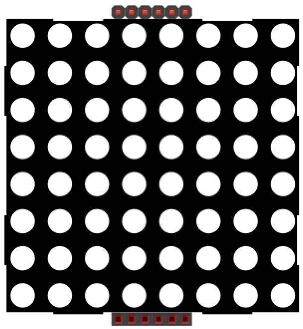
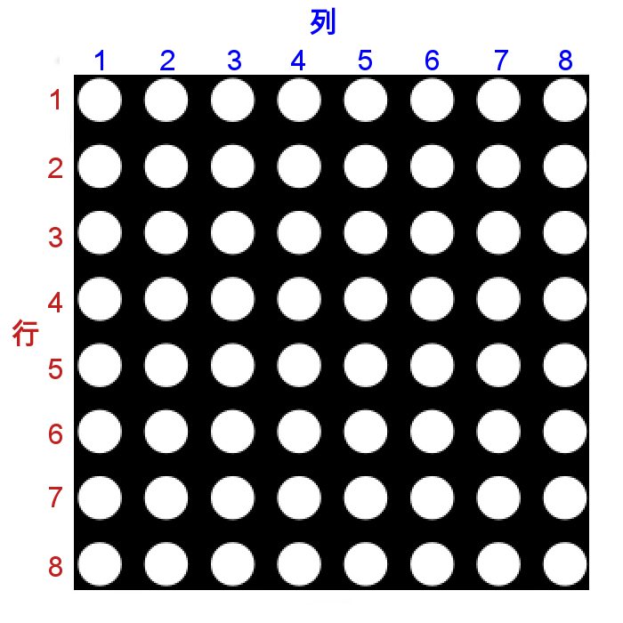
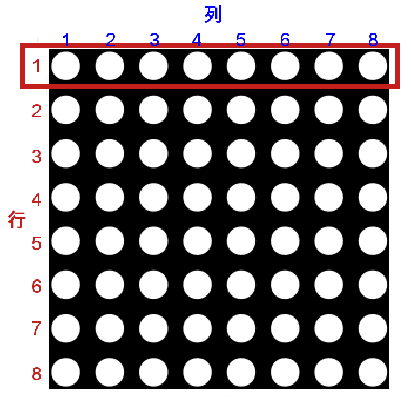
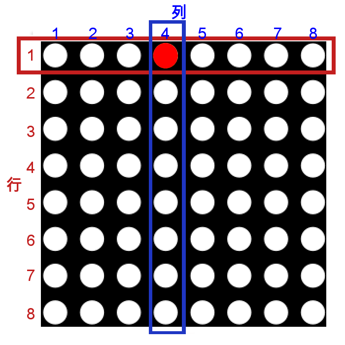
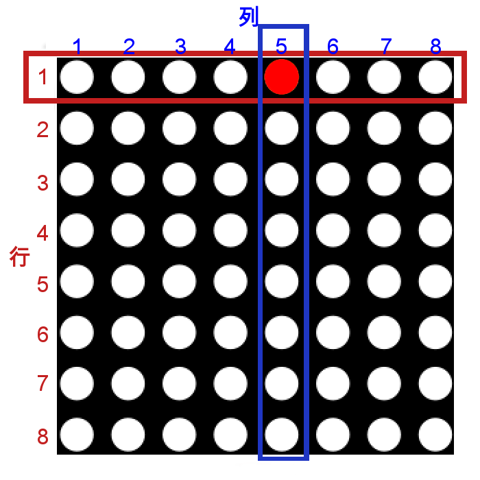
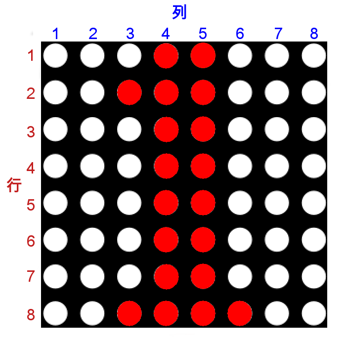
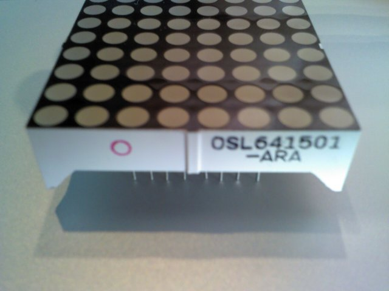
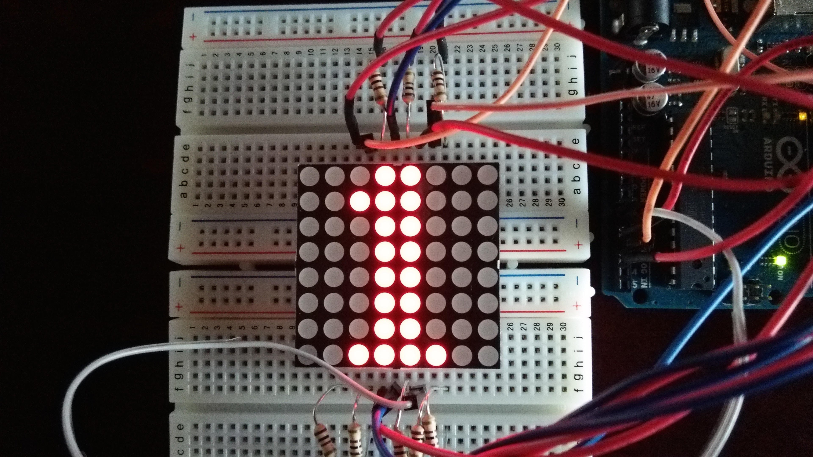

# 15.LEDマトリクス

## LEDマトリクス


今回使用するLEDマトリクスは、縦8、横8の計64個のLEDが組み込まれた装置です。

http://akizukidenshi.com/catalog/g/gI-05163/

このLEDマトリクスはダイナミック点灯という方式でLEDを点灯させています。
この方式は一行ずつLEDを非常に短い時間点灯させ、その残像を利用して全体が表示されているように見せる方式です。

各LEDは行(横)と列(縦)のHIGH(1)とLOW(0)の組み合わせにより点灯させます。
行がHIGH、列がLOWの状態、または行がLOW、列がHIGHの状態で点灯します。
<br>


最初に縦全てをLOW、横全てをHIGHで初期化しておきます。

まず<font color="FF0000">**１行目をHIGH**</font>で出力します。
この状態ではLEDは点灯しません。


<font color="FF0000">**１行目をHIGH**</font>、<font color="0000FF">**４列目をLOW**</font>で出力を行うと、行１、列４で交差する場所のLEDが点灯します。
<br>
**※点灯させたあとは次のLEDを付ける前に消灯(今回は4列目をHIGHに変更)させます。**
<br>


次に<font color="0000FF">**５列目をLOW**</font>で出力を行うと、行１、列５で交差する場所のLEDが点灯します。
<br>


上の様に短い時間に複数のLEDを連続で表示させることにより、下の様な文字が見えるようになります。
<br>



配置する向きですが、◯がある方が手前(下)になります。
<br>


## 文字の表示
最初は「１」を表示させてみようと思います。


### 回路

ブレッドボード１つでも作成は可能ですが、今回はわかりやすくするためにブレッドボード２つで作成してみましょう。


上下のブレッドボード別接続先一覧　(表上部の数字は左からの位置)

||1|2|3|4|5|6|7|8|
|--|--|--|--|--|--|--|--|--|
|上の段|A3|A2|抵抗+3番|10番|抵抗+5番|A1|13番|抵抗+2番|
|下の段|抵抗+6番|抵抗+8番|11番|12番|抵抗+9番|A0|抵抗+7番|抵抗+4番|


### スケッチ

```
 // 出力パターン「１」を格納する2次元配列
 boolean ledmatrix[8][8] = {
  {0,0,0,1,1,0,0,0},
  {0,0,1,1,1,0,0,0},
  {0,0,0,1,1,0,0,0},
  {0,0,0,1,1,0,0,0},
  {0,0,0,1,1,0,0,0},
  {0,0,0,1,1,0,0,0},
  {0,0,0,1,1,0,0,0},
  {0,0,1,1,1,1,0,0}
};
 
void setup(){
  // 2ピン～13ピン、A0ピン～A3ピンを14ピン～17ピンとして
  // 出力する設定を行う
  for(int i=2;i<=17;i++){
    pinMode(i,OUTPUT);
    digitalWrite(i,HIGH);
  }
}

void loop(){
  // 行(横)ループ(2番ピン～9番ピンを行として使用)
  for( int i = 2 ; i <= 9 ; i++ ){

    // 対象の行をLOW(0)に設定→対象行を点灯対象に設定
    digitalWrite( i , LOW );

    // 列(縦)ループ(10番ピン～17番ピンを列として使用)
    for( int j = 10 ; j <= 17 ; j++ ){
      // ピン番号と出力位置が異なるので位置補正して出力する
      digitalWrite( j , ledmatrix[ i - 2 ][ j - 10 ] );
      //  300マイクロ秒待機
      delayMicroseconds(300);
      //  対象列の消灯
      digitalWrite( j , LOW );
    }
    //  対象行の消灯
    digitalWrite( i , HIGH );
  }
}
```

デジタル出力用のピンは13番までですが、アナログ入力用のA0〜A5についてもpinMode()で出力用として指定することにより、デジタル出力用のピンとして使用することができます。

このようにLEDが点灯すれば成功です。
<br>



## 文字のスクロール

次は複数の数字をスクロールさせてみましょう。

回路はそのままでスケッチを変更します。

### スケッチ

```
 // 出力パターン「1 2 3」を格納する2次元配列 25列目は退避用
 boolean ledmatrix[8][25] = {
  {0,0,0,0,0,0,0,0,  0,0,0,0,0,0,0,0,  0,0,0,0,0,0,0,0,  0 },
  {0,0,0,0,1,0,0,0,  0,0,1,1,1,1,0,0,  0,0,1,1,1,1,0,0,  0 },
  {0,0,0,1,1,0,0,0,  0,1,0,0,0,0,1,0,  0,1,0,0,0,0,1,0,  0 },
  {0,0,0,0,1,0,0,0,  0,0,0,0,0,0,1,0,  0,0,0,0,0,0,1,0,  0 },
  {0,0,0,0,1,0,0,0,  0,0,1,1,1,1,0,0,  0,0,0,1,1,1,0,0,  0 },
  {0,0,0,0,1,0,0,0,  0,1,0,0,0,0,0,0,  0,0,0,0,0,0,1,0,  0 },
  {0,0,0,0,1,0,0,0,  0,1,0,0,0,0,0,0,  0,1,0,0,0,0,1,0,  0 },
  {0,0,0,1,1,1,0,0,  0,1,1,1,1,1,1,0,  0,0,1,1,1,1,0,0,  0 }
};
 
void setup(){
  // 2ピン〜13ピン、A0ピン〜A3ピンを14ピン〜17ピンとして
  // 出力する設定を行う
  for(int i=2;i<=17;i++){
    pinMode(i,OUTPUT);
    digitalWrite(i,HIGH);
  }
}

void loop(){
  // スクロールを遅くするため、待ち時間を設定
  int time = 5;
  // 
  while(time > 0){
    // 行(横)ループ(2番ピン〜9番ピンを行として使用)
    for( int i = 2 ; i <= 9 ; i++ ){

      // 対象の行をLOW(0)に設定→対象行を点灯対象に設定
      digitalWrite( i , LOW );

      // 列(縦)ループ(10番ピン〜17番ピンを列として使用)
      for( int j = 10 ; j <= 17 ; j++ ){
        // ピン番号と出力位置が異なるので位置補正して出力する
        digitalWrite( j , ledmatrix[ i - 2 ][ j - 10 ] );
        //  300マイクロ秒待機
        delayMicroseconds(300);
        //  対象列の消灯
        digitalWrite( j , LOW );
      }
      //  対象行の消灯
      digitalWrite( i , HIGH );
    }
    time--;
  }
    //スクロール処理
  for( int k = 0 ; k < 8 ; k++ ){
    //以下の配列数の値を変更しておく
    for( int l = 0 ; l <= 24 ; l++ ){
      // 0の場合は退避してから1つずらす
      if( l == 0) {
        ledmatrix[k][24] = ledmatrix[k][l];
        ledmatrix[k][l]  = ledmatrix[k][l+1];
        
      }else{
        ledmatrix[k][l] = ledmatrix[k][l+1];
      }
    }
  }
}
```

## 時間経過による文字の切り替え

次は時間で数字が切り替わるようにしてみましょう。
今回もスケッチのみの変更になります。

### スケッチ

```
 // 出力パターン「1 2 3」を格納する2次元配列 
 boolean ledmatrix[8][24] = {
  {0,0,0,0,0,0,0,0,   0,0,0,0,0,0,0,0,   0,0,0,0,0,0,0,0, },
  {0,0,0,0,1,0,0,0,   0,0,1,1,1,1,0,0,   0,0,1,1,1,1,0,0, },
  {0,0,0,1,1,0,0,0,   0,1,0,0,0,0,1,0,   0,1,0,0,0,0,1,0, },
  {0,0,0,0,1,0,0,0,   0,0,0,0,0,0,1,0,   0,0,0,0,0,0,1,0, },
  {0,0,0,0,1,0,0,0,   0,0,1,1,1,1,0,0,   0,0,0,1,1,1,0,0, },
  {0,0,0,0,1,0,0,0,   0,1,0,0,0,0,0,0,   0,0,0,0,0,0,1,0, },
  {0,0,0,0,1,0,0,0,   0,1,0,0,0,0,0,0,   0,1,0,0,0,0,1,0, },
  {0,0,0,1,1,1,0,0,   0,1,1,1,1,1,1,0,   0,0,1,1,1,1,0,0, }
};

  // 現在の文字の番号
  int count = 0;
  // 1文字に使用するLEDの数
  int tani  = 8;
 
void setup(){
  // 2ピン〜13ピン、A0ピン〜A3ピンを14ピン〜17ピンとして
  // 出力する設定を行う
  for(int i=2;i<=17;i++){
    pinMode(i,OUTPUT);
    digitalWrite(i,HIGH);
  }
}

void loop(){
  // スクロールを遅くするため、待ち時間を設定
  int time = 15;
  // 
  while(time > 0){
    // 行(横)ループ(2番ピン〜9番ピンを行として使用)
    for( int i = 2 ; i <= 9 ; i++ ){

      // 対象の行をLOW(0)に設定→対象行を点灯対象に設定
      digitalWrite( i , LOW );

      // 列(縦)ループ(10番ピン〜17番ピンを列として使用)
      for( int j = 10 ; j <= 17 ; j++ ){
        // ピン番号と出力位置が異なるので位置補正して出力する
        digitalWrite( j , ledmatrix[ i - 2 ][ j - 10 + count*tani ] );
        //  300マイクロ秒待機
        delayMicroseconds(300);
        //  対象列の消灯
        digitalWrite( j , LOW );
      }
      //  対象行の消灯
      digitalWrite( i , HIGH );
    }
    time--;
  }
  
  // 最後の文字まで出力したら最初に戻す
  if (count >= 2){
    count = 0;
  }
  else{
    count++;
  }
}
```

## 自由に表示してみよう

ここまでできた方は文字を変えたり、文字数を変えてみたりなど、自由に表示させてみましょう。

