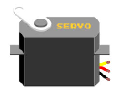
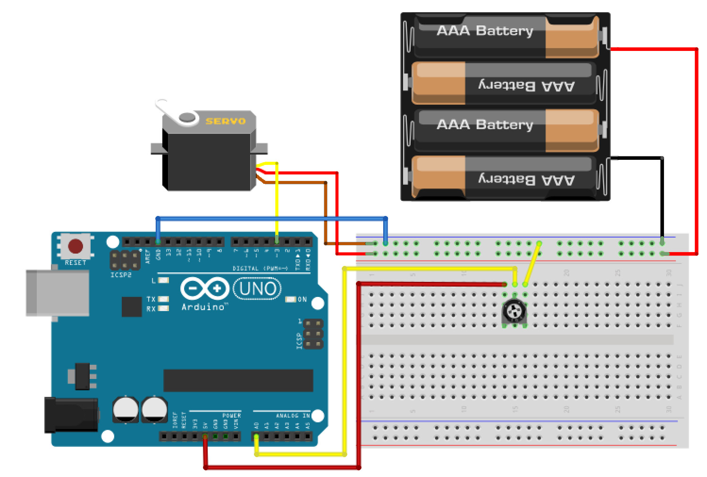
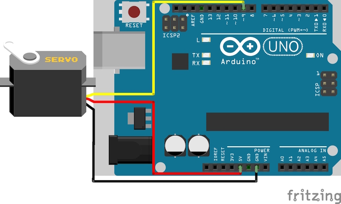

# 16.サーボモーター


## サーボモーター



サーボモーターとは、位置や速度など制御するモーターで、ロボットの関節等に使用されます。

## 回路

回路を作成してみましょう。
今回は外部電源(電池)を使用するため、プラスマイナスや、ショートに注意して下さい。




## スケッチ

スケッチしてみましょう。
電池を入れる前にスケッチ書き込みを行い、一旦PCから外してから電池をセットし、もう一度接続して確認しましょう。

```
#include <Servo.h>

int servo_pin = 3;
int vol_pin   = 0;

Servo myservo;

void setup() 
{ 
    myservo.attach(servo_pin);
} 

void loop() 
{ 
    // 可変抵抗のデータを取得
    int get_data = analogRead(vol_pin);
    // 取得した可変抵抗の電圧を位置情報に変換
    int move_pos = map(get_data, 0, 1023, 0, 180);
    // サーボモーターを動かす
    myservo.write(move_pos);
    delay(10);
} 
```

可変抵抗をドライバー等で操作し、サーボモーターの動きを確認してみましょう。


## プログラムでサーボモーターを制御
次は、プログラムにてサーボモーターを制御してみましょう。

サーボモーターを動かす場合は、下記の関数で位置を指定する必要があります。
```
myservo.write( 位置 );
```
<br>
myservo.write(0);とすると角度が0度の場所に移動し、
<br>
myservo.write(180);とすると角度が180度の場所に移動する
<br>
といったイメージです。

**※サーボモーターには移動できる範囲があり、その範囲(今回使用するものでは0〜200程度)を超えて移動させようとするとサーボモーターが壊れる可能性がありますので注意して下さい。**

ループ処理にて0から1ずつ移動し、180になったら0まで移動する処理を作ってみましょう。


```
#include <Servo.h>

Servo myservo;
#define servo_pin 9
#define max_pos 180
#define min_pos 0

int mv = 1;  // 1度に移動する角度
int pos = 0; // 位置

void setup() {
  myservo.attach(servo_pin);
  Serial.begin(9600);
} 

void loop() 
{ 
    pos += mv;

    // 限界地点まで移動した場合、移動する向きを反転
    if (pos > max_pos){
      pos = max_pos;
      mv *= -1;
    } else if(pos < min_pos){
      pos = min_pos;
      mv *= -1;
    }
    // サーボモーターを動かす
    myservo.write(pos);
    delay(30);
}```