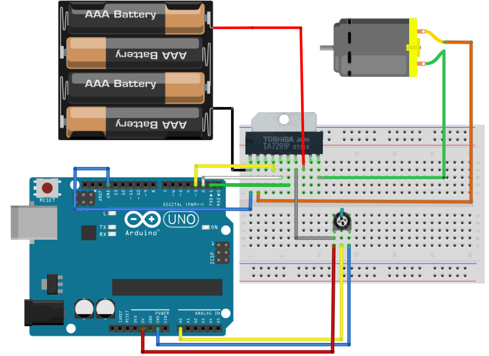

# モータードライバ（DCモーター）

## モータードライバ
モータードライバとは、外部電源で駆動しているモーターの電圧制御を行うことができるようになる装置です。
車などで行うと前進、後退、停止などの動作を行うことができます。
 


モータードライバにはいくつか種類がありますが、今回はDCモーター用のものを使用します。

モータードライバ  TA7291P
<br>
http://akizukidenshi.com/catalog/g/gI-02001/


モータードライバのピンについて説明します。
文字が書いてある面を正面に、左から順に番号が振ってあります。


 |No|内容|接続先|
|--|--|--|
|1|電源(GND)|GND、外部電源−|
|2|OUT1|モーター用|
|3|使用しない|接続無し|
|4|制御電源(モーターの速度)|3番ピン(PWM)
|5|IN1(信号1)|2番ピン
|6|IN2(信号2)|1番ピン
|7|電源(+)|5v
|8|出力側電源|外部電源＋
|9|使用しない|接続無し
|10|OUT2|モーター用|


５番と６番の出力の組み合わせでモーターの動きを制御します。

|5番ピン(IN1)|6番ピン(IN2)|モーターの動き|
|--|--|--|
|<font color='#0000FF'>LOW|<font color='#0000FF'>LOW|静止|
|<font color='#FF0000'>HIGH|<font color='#0000FF'>LOW|前進|
|<font color='#0000FF'>LOW|<font color='#FF0000'>HIGH|後退| 

## 回路

今回は外部電源(電池)を使用するため、プラスマイナスや、ショートに注意しましょう。
 



## スケッチ

最初に前進の動作を行います。

電池を入れる前にスケッチ書き込みを行い、一旦PCから外してから電池をセットし、もう一度接続して確認しましょう。

```c
void setup(){
  pinMode(1,OUTPUT); //信号用ピン 6番ピン
  pinMode(2,OUTPUT); //信号用ピン 5番ピン
}

void loop(){
  //アナログ入力:0番ピンの値を4で割る
  int val = analogRead(0) / 4; //0~255の値にする
  
  // 5番ピンをHIGH, 6番ピンをLOW
  digitalWrite(1,LOW);
  digitalWrite(2,HIGH);

  //valが大きいほど出力値も大きくなる
  analogWrite( 3 , val ); //出力値:1~255
}
```


確認できましたら、今度は逆転をやってみましょう。

```c
void setup(){
  pinMode(1,OUTPUT); //信号用ピン 6番ピン
  pinMode(2,OUTPUT); //信号用ピン 5番ピン
}

void loop(){
  //アナログ入力:0番ピンの値を4で割る
  int val = analogRead(0) / 4; //0~255の値にする
  
  // 5番ピンをLOW, 6番ピンをHIGH
  digitalWrite(1,HIGH);
  digitalWrite(2,LOW);

  //valが大きいほど出力値も大きくなる
  analogWrite( 3 , val ); //出力値:1~255
}
```

## 可変抵抗による前進、停止、後退の制御

ここまでできましたら、可変抵抗の値によって前進、後退、停止するスケッチを書いてみましょう。

```c
 void setup(){
  pinMode(1,OUTPUT); //信号用ピン 6番ピン
  pinMode(2,OUTPUT); //信号用ピン 5番ピン
}

void loop(){
  //アナログ入力:0番ピンの値を２で割る
  int val=analogRead(0)/2; //0~511の値にする
  
  //静止／前進／後退の状態に分けてプログラムする
  if(val>=250 && val<=260){
    //250から260の間は静止
    digitalWrite(1,LOW);
    digitalWrite(2,LOW);
  }else if(val>260){
    //260から511の場合は前進
    digitalWrite(1,HIGH);
    digitalWrite(2,LOW);
    //valが大きいほど出力値も大きくなる
    analogWrite(3,val-256);
  }else{
    //0から249の場合は後退
    digitalWrite(1,LOW);
    digitalWrite(2,HIGH);
    //valが小さいほど出力値は大きくなる
    analogWrite(3,255-val); //出力値:1~255
  }    
}
```

###可変抵抗なし回路


###可変抵抗、電池なし回路


### 可変抵抗なし回路のスケッチ(電池なしもOK)

```c
void setup(){
  pinMode(1,OUTPUT); //信号用ピン 6番ピン
  pinMode(2,OUTPUT); //信号用ピン 5番ピン
}

void loop(){
  //モーターの強さ指定
  int val = 255; //0~255の値にする
  
  // 信号1をHIGH, 信号2をLOW
  digitalWrite(1,HIGH);
  digitalWrite(2,LOW);

  //valが大きいほど出力値も大きくなる
  analogWrite( 3 , val ); //出力値:1~255
}```