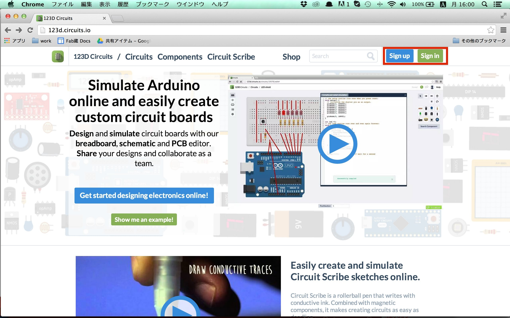
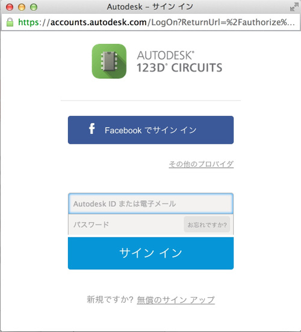
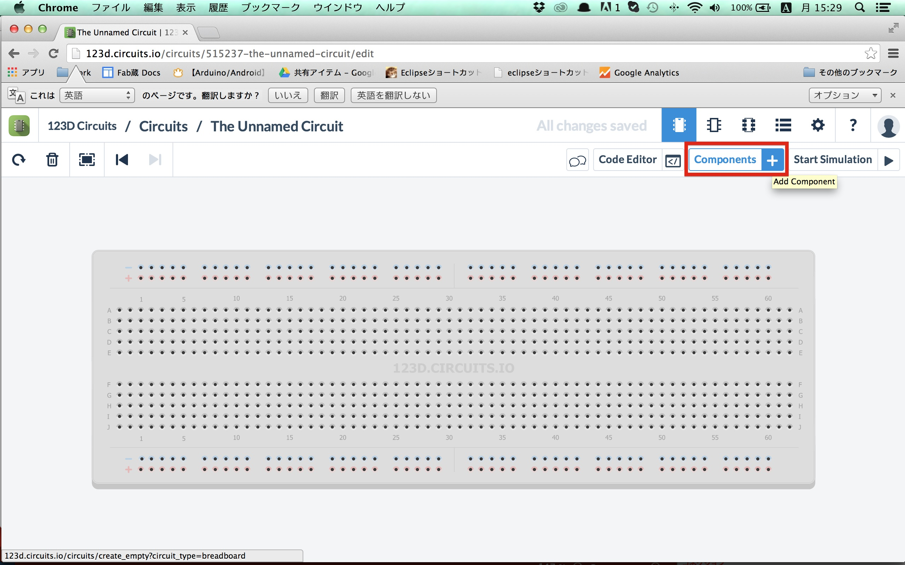
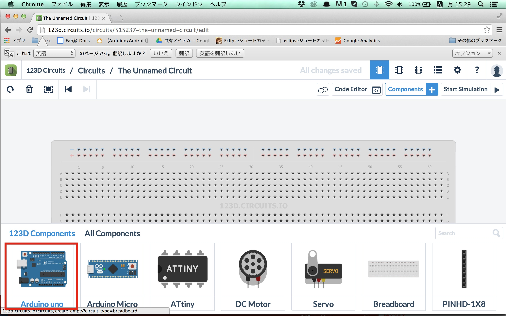
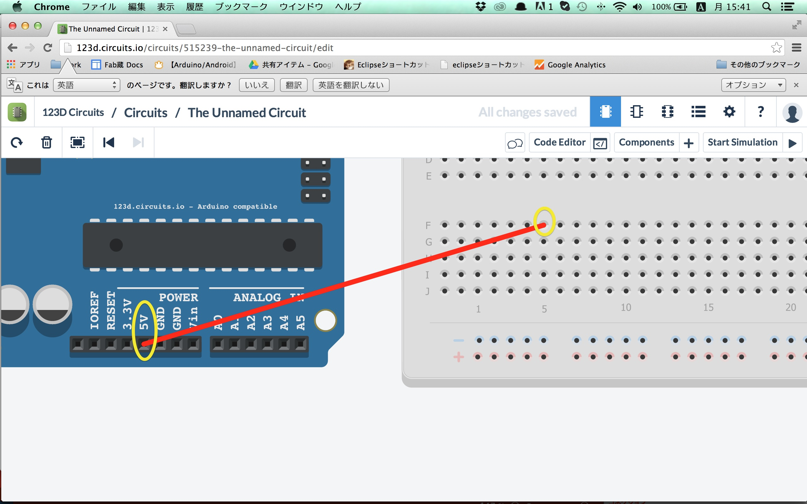
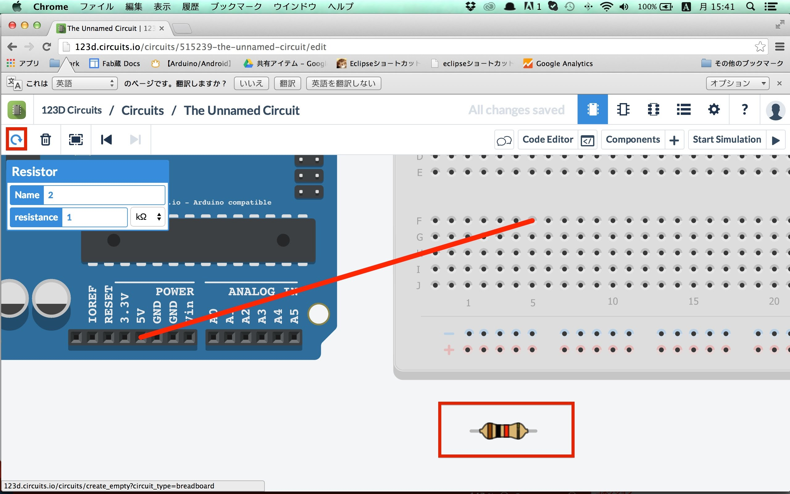
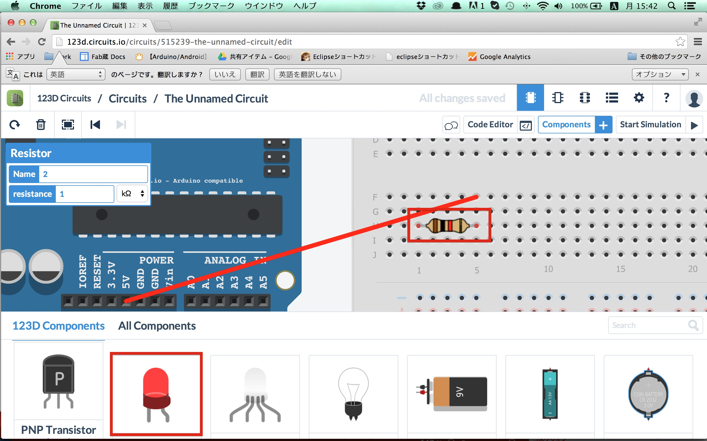
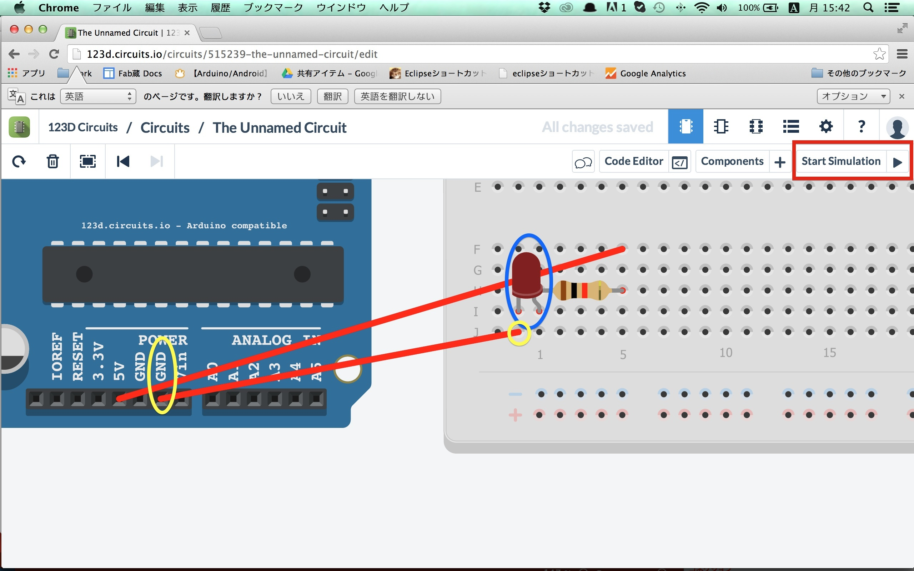
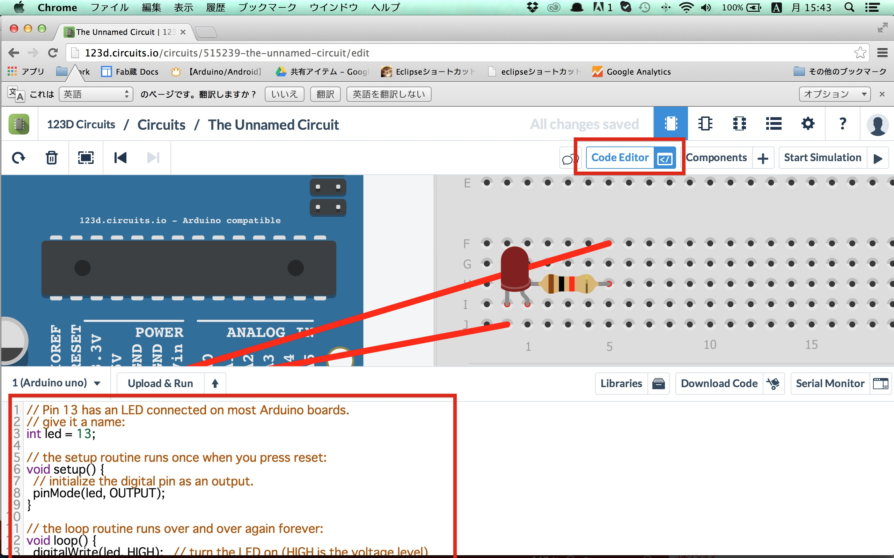

# 2.123D Circuitsを使ってみよう

123D Circuitsとはブラウザ上で電子工作が行えるWebサービスです。
 
Arduino本体やセンサー等が無くても回路を作成し、実行結果を画面でみることができます。

http://123d.circuits.io/

まずサインインしてみましょう。
 
既に123Dでアカウントをお持ちの方は「Sign in」、お持ちでない方は「Sign up」をクリックしてみましょう。
 

「Sign in」をクリックした場合の画面です。
 
facebookのアカウントがあれば登録は必要ありません
無い場合でもEmailとパスワードを設定すればすぐ使うことができます。
 

サインインするとブレッドボードというもののみ表示されています。
 
まずはArduinoを追加するため、画面右上の「Components」を選択します。
 

画面下に一覧が出てきますので、少し下にスクロールして「Arduino uno」を選択します。
 

画面上のどこでもいいのでもう一度クリックし、Arduino unoを配置します。
 
配置したオブジェクトはドラッグ&ドロップで移動することがきます。

Arduinoの下側に「5V」という箇所があるのでクリックします。
 
その後、右のブレッドボード（穴の空いた板）のFの左から7番目の位置をクリックすると赤い線が引かれます。

次に抵抗を配置します。
 
Componentsより「Resistor」を選択し、配置します。

置いた状態では抵抗が縦向きに配置されますので、画面左上の回転マークをクリックし、抵抗を回転させます。

抵抗の右側をHの左から7番目になるように配置します。
 
その後、ComponentsよりLEDを配置します。

LEDの右側をIの左から3番目の位置になるように配置します。
 
その後、ArduinoのGNDと、Jの左から2番目を線で繋ぎます。
 
繋ぎ終わりましたら、右上の「StartSimulation」を押して実行し、LEDが点灯することを確認しましょう。

プログラムを変更する場合は、「Code Editor」をクリックします。
 
変更が完了しましたら、プログラムの上にある「Upload&Run」を押すことで結果を確認することができます。

