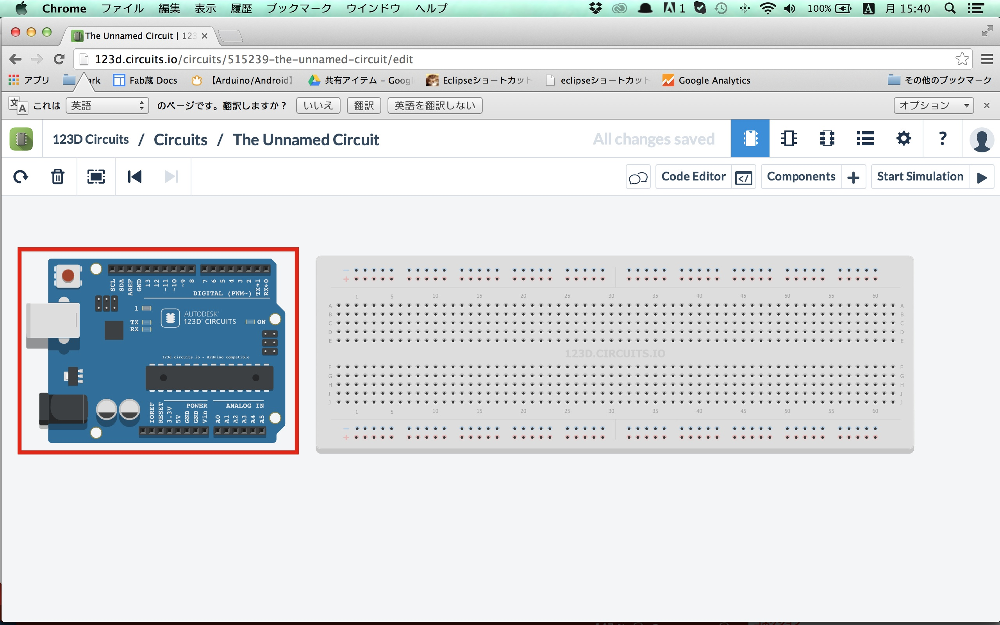
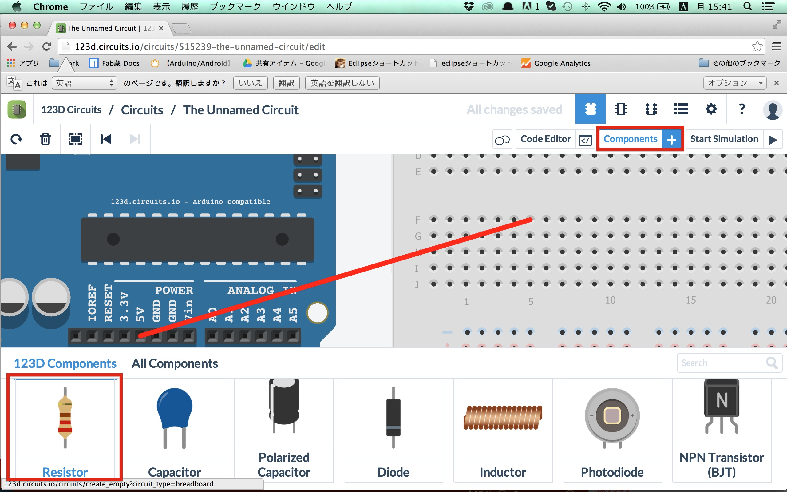

# 2.123D Circuitsを使ってみよう

123D Circuitsとはブラウザ上で電子工作が行えるWebサービスです。
Arduino本体やセンサー等が無くても回路を作成し、実行結果を画面でみることができます。

http://123d.circuits.io/

まずサインインしてみましょう。
既に123Dでアカウントをお持ちの方は「Signup」、お持ちでない方は「Signin」をクリックしてみましょう。

SignUpをクリックした場合の画面です。
facebookのアカウントがあれば登録は必要ありません
無い場合でもEmailとパスワードを設定すればすぐ使うことができます。

サインインするとブレッドボードというもののみ表示されています。
まずはArduinoを追加するため、画面右上の「Components」を選択します。

画面下に一覧が出てきますので、少し下にスクロールして「Arduino uno」を選択します。

画面上のどこでもいいのでもう一度クリックし、Arduino unoを配置します。
配置したオブジェクトはドラッグ&ドロップで移動することがきます。

Arduinoの下側に「5V」という箇所があるのでクリックします。
その後、右のブレッドボード（穴の空いた板）のFの左から7番目の位置をクリックすると赤い線が引かれます。

次に抵抗を配置します。
Componentsより「Resistor」を選択し、配置します。
