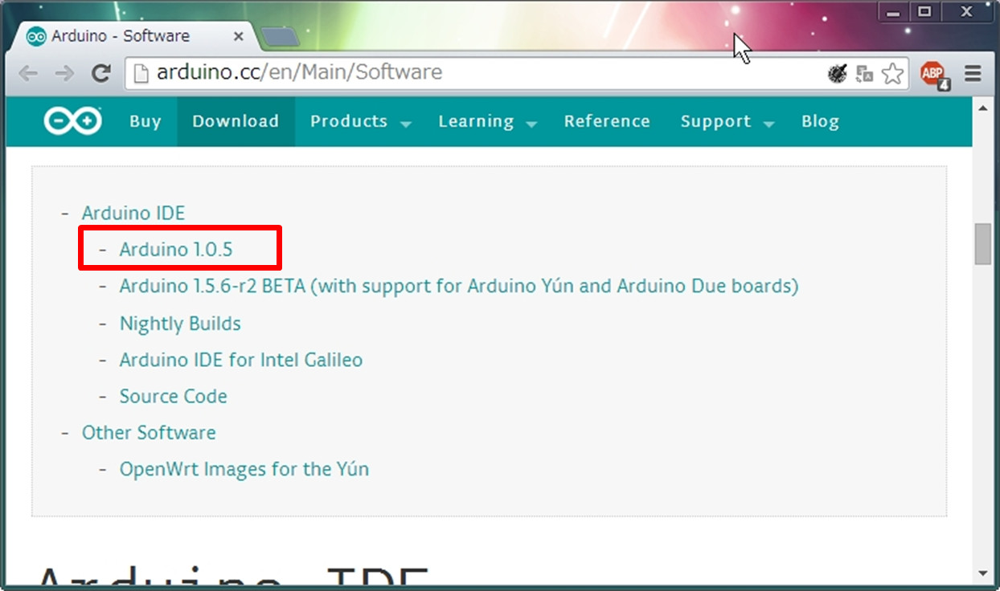
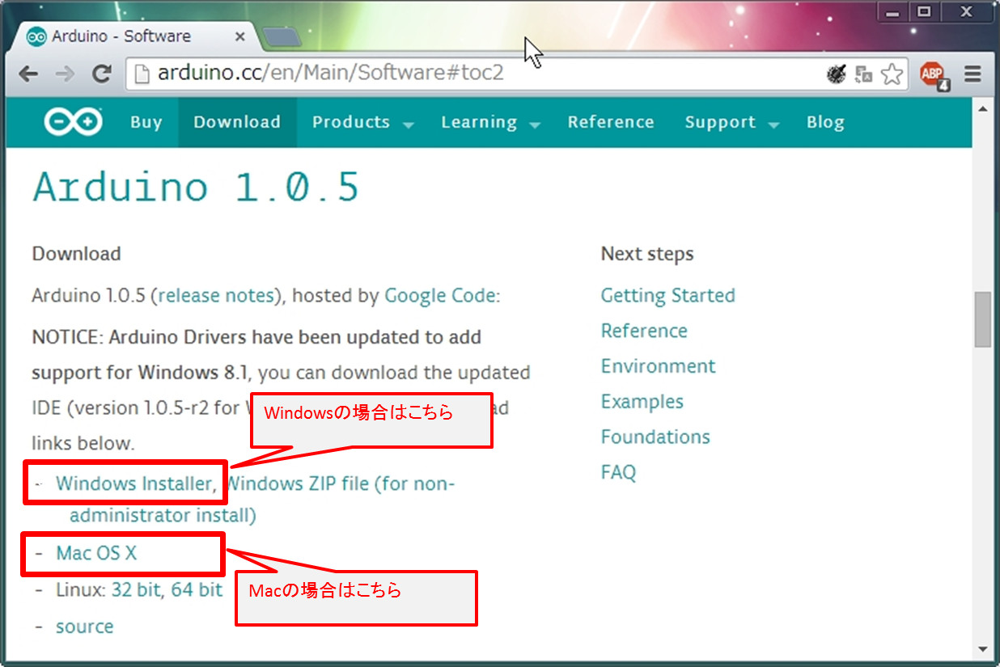

# 3.ArduinoとPCを接続してみよう

開発環境設定

まず、ケーブルで繋ぐ前に開発環境を設定します。

※このテキストでは1.0.5を使用していますが、その時点の最新バージョンをご使用下さい。
 
以下よりArduino IDE(最新版1.0.5)をダウンロードし、インストールします。
http://arduino.cc/en/Main/Software

「Arduino IDE」より「Arduino1.0.5」を選択します。

Windowsマシンの場合は「Windows　Installer」、MACの場合は「Mac　OS　X」を選択します。 

選択するとダウンロードされますので、完了したらインストールを行います。

PCとArduinoを接続

インストールが完了したら、ArduinoとPCをUSBケーブルで繋ぎます。 

先ほどインストールしたArduino IDEを起動し、マイコンボード、シリアルポートの設定を行います。

・マイコンボードの設定
メニューの「ツール」→「マイコンボード」より、今回使用する「Arduino UNO」を選択します。

・シリアルポートの設定

MACの場合
　シリアルポートより「/dev/tty.usbmodemfa～」を選択します。

Windowsの場合
デバイスマネージャにて「Arduino UNO」が設定されているポートを指定します。
デバイスマネージャーは、「コントロールパネル」→「システム」→「デバイスマネージャー」より表示されます。
※「Windows」キーを押しながら「R」キーで「ファイル名を指定して実行」を起動し、「devmgmt.msc」と入力して決定でも表示されます。

メニューの「ツール」→「シリアルポート」より、使用するポートを選択します。
設定する内容は、デバイスマネージャなどでArduino Unoの右側に表示されているポートとなります。
今回の例ではCOM9となります。
Windowsの場合は表示まで少し時間がかかる場合がありますので、表示されない場合はしばらく待ってから再度試して下さい。

サンプルコード読み込み

メニューより、「スケッチ例」→「01.Basics」→「Blink」を選択します。

「Blink」を選択すると自動的にコードが生成されます。
Arduinoではこのコードをスケッチと呼びます。

スケッチの内容については、後ほど説明します。

実機転送

自動生成したスケッチをマイコンボードに書き込みます。
メニューより、「マイコンボードに書き込む」を選択します。

書き込みに成功すると、「マイコンボードへの書き込みが完了しました。」のメッセージが表示されます。

ここでエラーとなる場合は、マイコンボード設定、シリアルポート設定に誤りがある可能性がありますので、一度ご確認下さい。
それでもエラーがでる場合、配線のミスや基盤の不具合の可能性があります。

処理結果確認

書き込みが正しく完了するとArduinoについているランプが点灯します。
緑が常時点灯、オレンジが点滅です。
