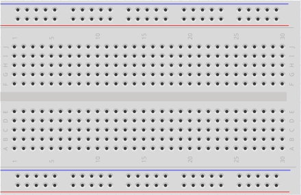
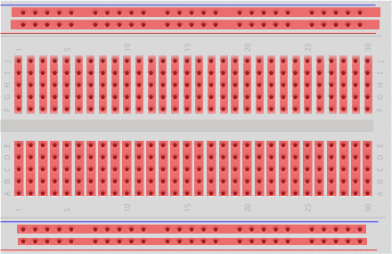
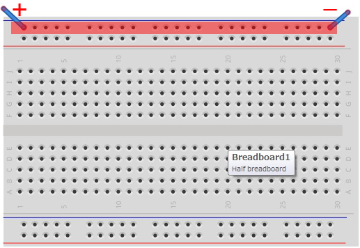

# 4.ブレッドボード

回路作成にはブレッドボードを使用します。

#### **ブレッドボードとは**

ブレッドボードとは、ハンダ付けを行わずにセンサーやコードなどを穴に差し込むだけで電子回路を作成できる基盤です。
 
付け替えが容易なため、回路の試作などに利用されます。

ブレッドボードは赤枠内が線が繋がっています。

下のパターンは＋と－が同じ赤枠の中にあるため、電流がながれます。
