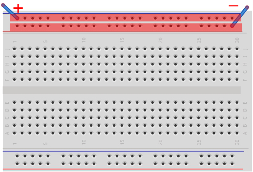
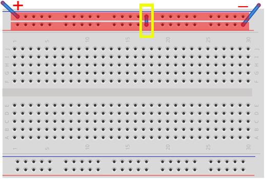

# 4.ブレッドボード

回路作成にはブレッドボードを使用します。

#### **ブレッドボードとは**

ブレッドボードとは、ハンダ付けを行わずにセンサーやコードなどを穴に差し込むだけで電子回路を作成できる基盤です。
 
付け替えが容易なため、回路の試作などに利用されます。
 

ブレッドボードは赤枠内が線が繋がっています。
 

下のパターンは＋と－が同じ赤枠の中にあるため、電流がながれます。
 

次のパターンは＋と－が同じ枠内に入っていないため、電流がながれません。
 

その場合は、黄色部分に配線することにより赤部分が繋がるため電流がながれるようになります。
 
