# 5.LEDを点灯させてみよう


これから回路の作成に入って行きますが、作成する際には以下の３点に注意しましょう。

<font color="FF0000">
　１．LEDなど、極性(プラスマイナス)があるものは向きを間違えない。
　足が長い方が「＋」、短い方が「－」となります。
</font>
<br>　
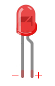

<font color="FF0000">
　２．LEDなどをつける場合は必ず抵抗をつけること。
</font>
<br>


<font color="FF0000">
LEDやセンサーが破損することがあります。
また発熱によりやけどする可能性もありますので注意して下さい。
</font>
<br>

<font color="FF0000">
　３．回路を作成する際はArduinoとPCを接続しない。
<br>

### 5Vピンから繋げてみよう


それではArduinoとブレッドボードを使用しLEDを点灯させてみましょう。
最初は１つずつ一緒にやっていこうと思います。

ブレッドボードは「マイナス(青線)」が上にくるように置きます。
<br>
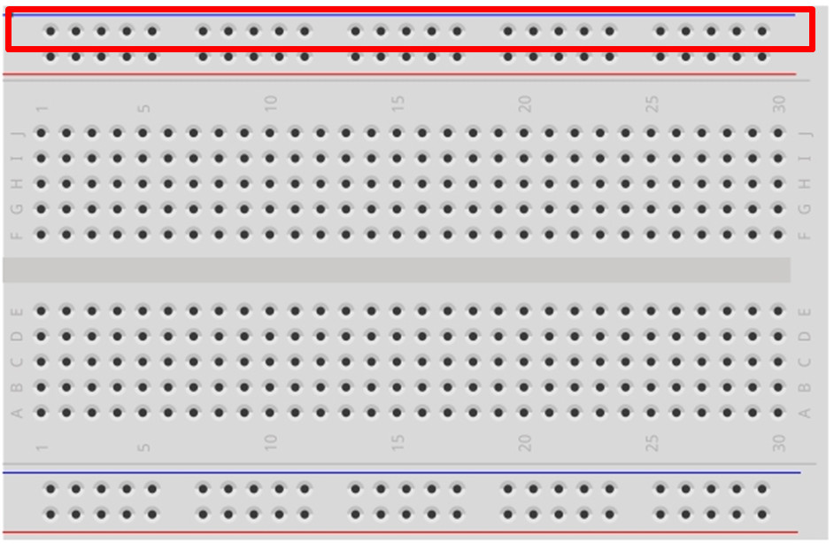

①５Vとプラス列の１番目を配線します。
<br>
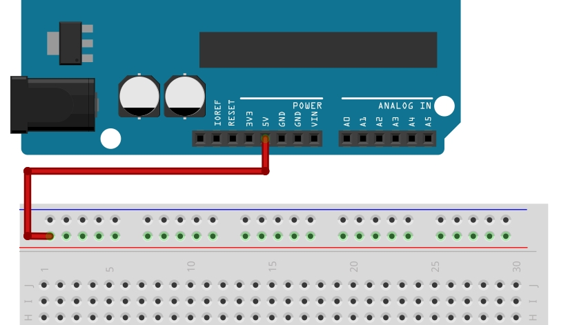

②GNDとマイナス列の１番目を配線します。
<br>
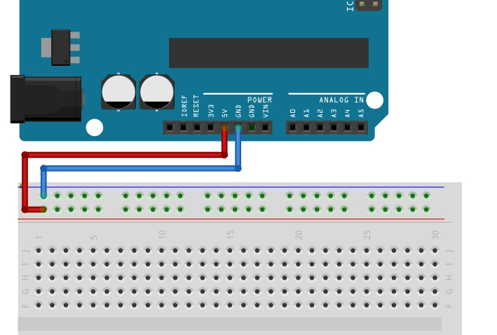

③プラスの列16番目から、その下にあるJの20に配線します。
<br>


④Gの15とGの20に抵抗をつけます。
<br>
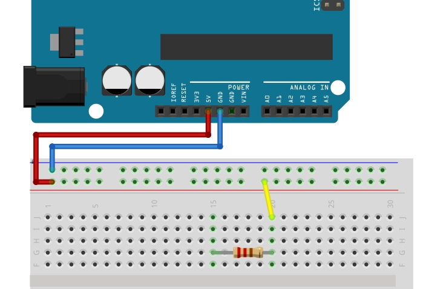

⑤次はLEDを取り付けます。
<br>
LEDには極性(プラスマイナス)があるので注意して下さい。
Hの10に短い線(マイナス)、Hの15に長い線(プラス)を取り付けます。
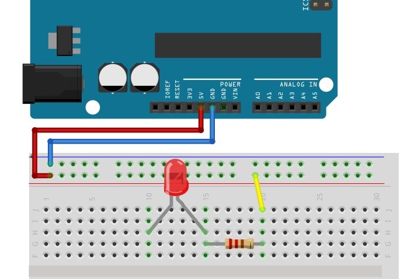

⑥最後にマイナス列の6番目とHの10を配線します。
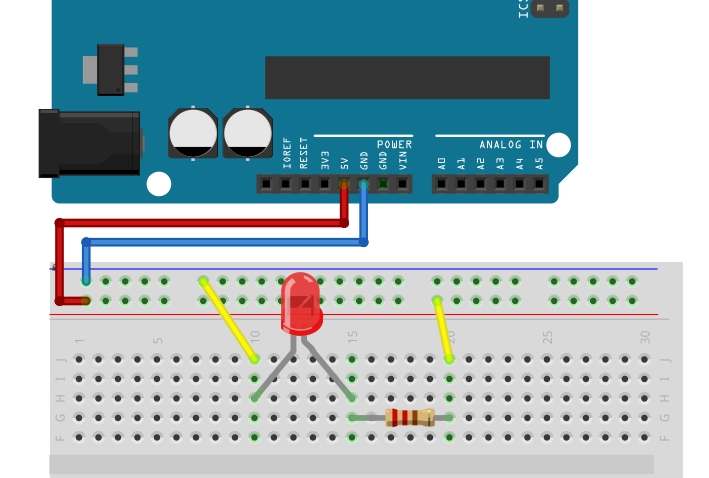

これで電気が流れるようになりました。
イメージ的には5Vが「＋」、GNDが「－」となり電流がながれるような感じになります。
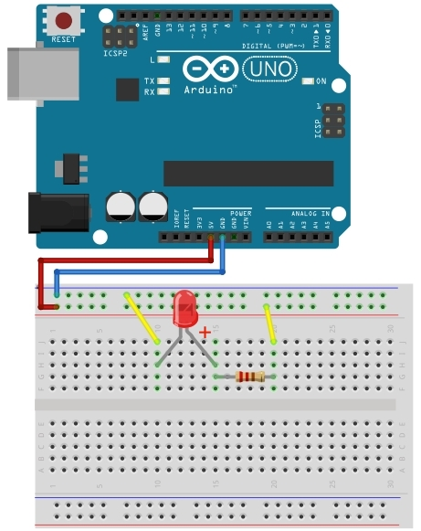

ここまでできたらArduinoとPCを繋げてみましょう。
下の写真のようにLEDが光れば成功です。
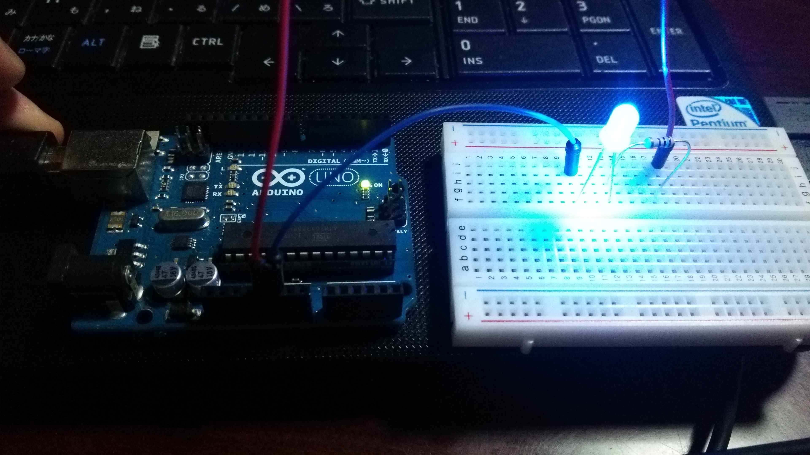

### プログラムからLEDを点灯させてみよう


ここで先ほどのサンプルスケッチの説明をします。
<br>
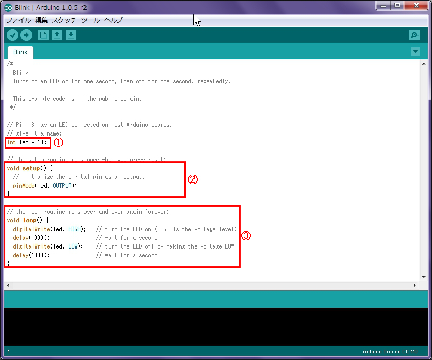


スケッチの内容は以下のようになります。

#### ①変数定義

```
int led = 13;
```
部分は変数の定義で「led」という変数に13を設定しています。
ここでの意味としては、これから13ピンを操作するということです。

#### ②初期処理「void setup()」（起動時に1度だけ行う処理）
```
void setup() {
         
  pinMode(led, OUTPUT);     

}
```
13ピンに対して、これから出力を行うという設定です。

#### ③ループ処理「void loop()」（初期処理後に実行され、繰り返し行う処理)

```
void loop() {

  digitalWrite(led, HIGH);

  delay(1000);

  digitalWrite(led, LOW);

  delay(1000);

}
```

このループ処理は１秒ごとにLEDを点けたり消したりするという内容になります。

```
digitalWrite( ピン番号 , HIGHまたはLOW );
```

ピン番号にデジタルデータを出力する処理です。
この場合は、HIGHの場合はLEDを点灯、LOWは消灯を表しています。

```
delay( 数値 );
```

指定したの数値(1000分の1秒単位)待機する処理です。


次に回路を作成してみましょう。
先ほどの回路から２か所変更します。
5Vを13に、下のGNDを上のGNDに変更しています。
なお、GNDは３カ所ありますが、どこでも同じですので変更せずにそのままの状態でも問題ありません。
<br>
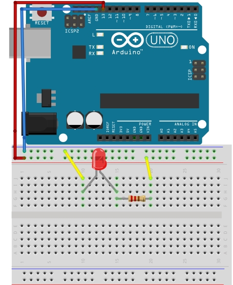

作成した回路をPCにつなげ、LEDが点滅することを確認してみましょう。
<br>
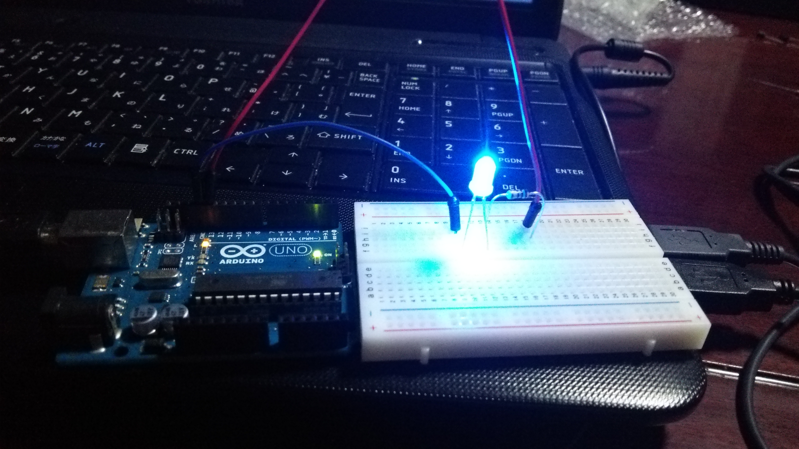
<br>
LEDが１秒ごとに点滅するようになりました。