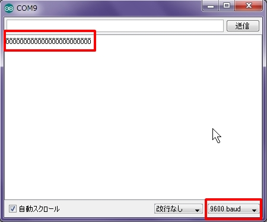

# 6.スイッチを使ってみよう

## タクトスイッチ


今回は押しボタン式のタクトスイッチを使用します。

ボタンを押していない状態では縦方向のみ電気が流れます。

ボタンを押している間は横方向への電気が流れるようになります。


## スイッチでLEDを点灯させてみよう

それでは先ほどのLED点灯回路に組み込んでみましょう。
<br>


まずはそのままPCに繋げてみましょう。

スイッチを押していない状態ではLEDは点灯しません。
<br>


スイッチを押すとLEDが点灯します。
<br>


## スイッチのデータを取得してみよう


次に、ボタンスイッチの押下状態をデータで取得してみます。
回路は以下のようにしてみます。
<br>


ボタンスイッチのステータスを取得するためにDIGITALの7番ピンを使用します。

## スケッチ

```c
int b_pin = 7;   // デジタルデータ出力用ピン番号
int state = 0;   // ピンより取得したデータ格納用

void setup() {
  Serial.begin(38400);  
  pinMode(b_pin, INPUT);     // ボタンスイッチ用に入力に設定
}

void loop() {
  state = digitalRead(b_pin);  // ピンよりデータ取得
  Serial.println(state);       // シリアルモニタに出力
  delay(500);
}
```

ボードへの書き込み完了後、シリアルモニタを開いてみましょう。
シリアルモニタは画面右上にある虫眼鏡マークを押すと表示されます。<br>


シリアルモニタが起動されますが、出力内容が正しくありません。
<br>
これは「Serial.begin」で設定した数値（38400）と、
シリアルモニタの右下の赤枠部分の数値（9600）が異なるためです。

右下の赤枠部分をクリックし、38400に変更してみましょう。<br>


38400に変更すると数値が出力されるようになりました。
<br>
この状態でスイッチを押してみましょう。
<br>


スイッチを押していない状態で0、スイッチを押している状態で1が表示されます。
<br>


## スイッチで点灯させるLEDを切り替えてみよう


ここまでできた方は、取得したデータによる処理の分岐をさせてみましょう。

スイッチを押していないときは1つ目のLEDのみ点灯し、スイッチを押している場合は2つ目のLEDのみ点灯するという回路を作ってみたいと思います。

###回路
今回追加したのは12、13番ピンからそれぞれのLEDを通し、GNDまで繋げる箇所となります。
<br>


###スケッチ

```c
int b_pin = 7;  // デジタルデータ出力用ピン番号
int state = 0;   // ピンより取得したデータ格納用

int led1  = 13; // 1つ目のLEDのピン番号
int led2  = 12; // 2つ目のLEDのピン番号

void setup() {
  Serial.begin(38400);     // シリアルモニタ出力レート
  pinMode(b_pin, INPUT);   // ボタンスイッチを入力に設定
  pinMode(led1, OUTPUT);   // 1つ目のLEDを出力に設定
  pinMode(led2, OUTPUT);   // 2つ目のLEDを出力に設定
}

void loop() {
  state = digitalRead(b_pin);  // ピンよりデータ取得
  Serial.println(state);       // シリアルモニタに出力

  //取得データにより分岐
  if(state == 0){
    digitalWrite(led1,HIGH);  // 1つ目のLEDを点灯
    digitalWrite(led2,LOW);   // 2つ目のLEDを消灯
  }
  else{
    digitalWrite(led1,LOW);   // 1つ目のLEDを消灯
    digitalWrite(led2,HIGH);  // 2つ目のLEDを点灯
  }
  
  delay(100);
}
```


今回出てきた「if」は以下のような内容になります。
```c
  if ( 条件 ) {
    条件に合った場合の処理
  }
  else {
    条件に合わなかった場合の処理
  }
```

スケッチまで終わりましたら書き込みを行い、結果を確認してみましょう。
