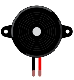
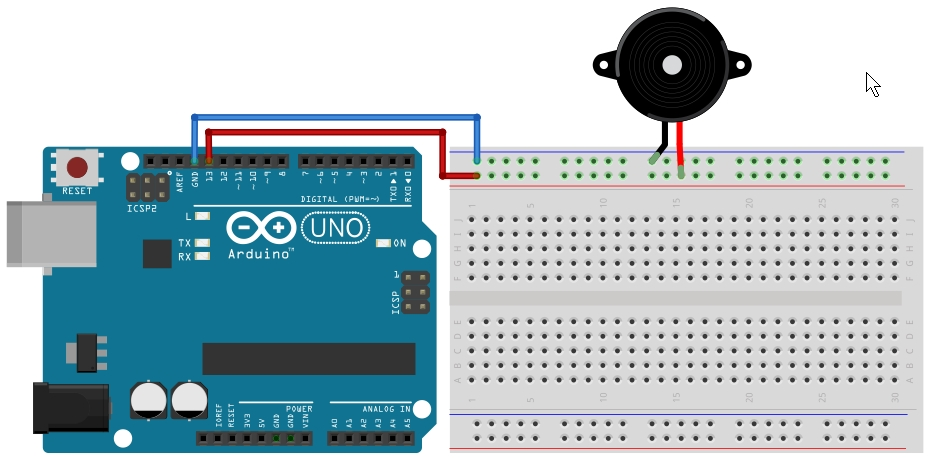

# 圧電ブザーを鳴らせてみよう

## 圧電ブザー

圧電ブザー(圧電スピーカー)はスケッチによりメロディを鳴らすことができます。
圧電ブザーは種類によって極性（プラスマイナス）があるものとないものがあります。
<br>


## 回路図

回路図は以下のようになります。
13ピンにから開始して圧電ブザーを置き、GNDに接続します。<br>


## スケッチ
スケッチしてみましょう。

```
int melo = 200;   // 音の長さを指定
int pin = 13;        // ブザーを接続したピン番号
  
void setup() {
}

void loop() {
     tone(pin,262,melo) ;  // ド
     delay(melo) ;              // 音がなっている間待機
     tone(pin,294,melo) ;  // レ
     delay(melo) ;
     tone(pin,330,melo) ;  // ミ
     delay(melo) ;

     delay(1000) ;              // 1秒待機
}
```

圧電ブザーを鳴らす場合「tone」関数を使用します。
```
tone( ピン番号 , 　周波数(鳴らす音) , 　音の長さ)
```

それではボードに書き込みしてみましょう。

ド、レ、ミの音が１秒間隔で鳴れば成功です。


音を鳴らせてみよう

下記の表を参考に、ドレミファソラシドまでの音を鳴らすスケッチを書いてみましょう。

音階と周波数は下記のようになります。
数値が大きくなるほど音が高くなります。

|   | ド | レ | ミ | ファ | ソ | ラ | シ |
| -- | -- | -- | -- | --   | -- | -- | -- |
| 1 | 131 | 147 | 165 | 175 | 196 | 220 | 247 |
| 2 | 262 | 294 | 330 | 349 | 392 | 440 | 494 |
| 3 | 523 | 587 | 659 | 698 | 784 | 880 | 988 |

ピアノの黒鍵盤(ドの♯など)を含めたもの

| | ド | ド♯ | レ | レ♯ | ミ | ファ | ファ♯ | ソ | ソ♯ | ラ | ラ♯ | シ |
|  -- | -- |-- | -- | -- | -- | -- | -- | -- | -- | -- | -- | -- |
|  1 | 131 | 139 | 147 | 156 | 165 | 175 | 185 | 196 | 208 | 220 | 233 | 247 |
| 2 | 262 | 277 | 294 | 311 | 330 | 349 | 370 | 392 | 415 | 440 | 466 | 494 |
 | 3 | 523 | 554 | 587 | 622 | 659 | 698 | 740 | 784 | 831 | 880 | 932 | 988 |

なお、今回は３オクターブ分のみ記述していますが、その他にも音はだせます。
詳細はこちらに記述してありますので、興味がある方はご参照下さい。
http://arduino.cc/en/Tutorial/tone

また、ここに記載されている数値以外の値でも音はでます。
例えば周波数165のミと周波数175のファの間の「170」と指定した場合でも音自体は出すことができます。
