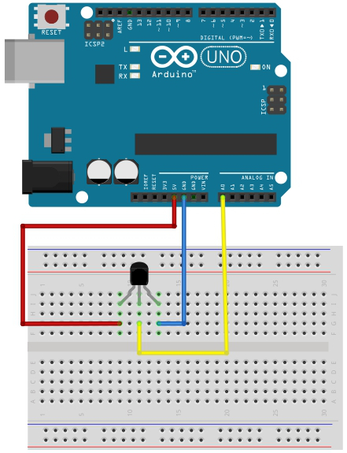
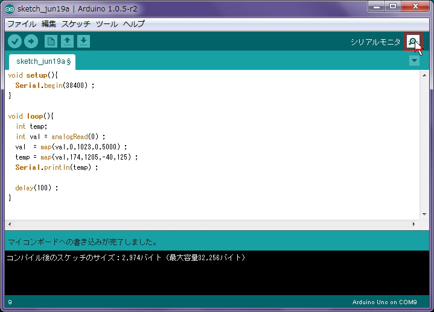
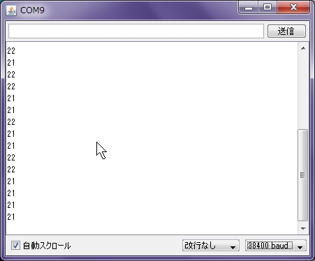
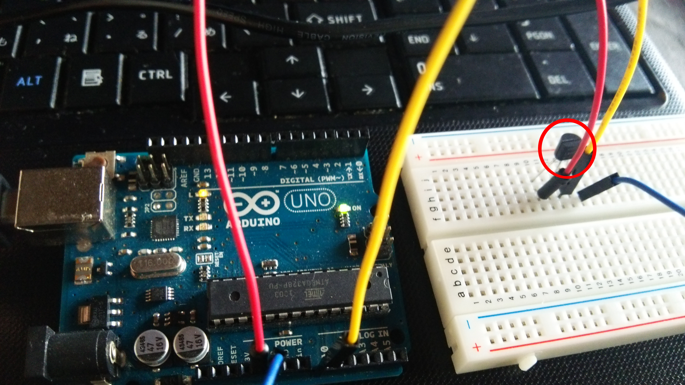

# 8.温度センサー

## センサー
今回使う温度センサーは「ＬＭ６０」です。
<br>
このセンサーでは-40度から125度まで測定することができます。
<br>
センサーの詳細はこちらに記載してあります。
<br>
http://akizukidenshi.com/download/LM60.pdf

## 回路

LEDの時と同様に5VからGNDへ繋げますが、今回はセンサーで取得した値出力するため、真ん中のピンをA0ピンへ接続します。
<br>
上から見た時に平らになっている面が下になるように回路を作成します。
<br>
**※向きを間違えると発熱し、やけどやセンサーの破損に繋がるので注意が必要です。**
<br>


## スケッチ
スケッチしてみましょう。

```c
void setup(){
  Serial.begin(38400) ; 
}

void loop(){
  int temp;
  int val = analogRead(0) ;  
  val  = map(val,0,1023,0,5000) ;    
  temp = map(val,174,1205,-40,125) ; 
  Serial.println(temp) ;           

  delay(100) ;  
}
```

スケッチの説明をします。
<br>
#### ①アナログデータ取得

```
int val = analogRead(0);
```
ここはA0からデータを取得しています。
このAnalogReadで取得してくるデータは、0mV(ミリボルト)が0、5000mVが1023という値になります。

#### ②取得したデータを変換

```c
val  = map(val,0,1023,0,5000) ;    
temp = map(val,174,1205,-40,125) ;
```

A0より取得したデータを温度に変換します。

mapは値を変換する関数です。
```c
map( 変換する値 , 変換前の下限 , 変換前の上限 , 変換後の下限 , 変換後の上限)
```
このセンサーは、－40℃～＋125℃の温度範囲で＋174mV ～＋1205mVになるので
このような記述になっています。

#### ③シリアルデータ画面出力

```c
Serial.println(temp);
```

変換したデータを出力します。
出力したデータはシリアルモニタにて確認することができます。
<br>


新しいウィンドウが表示され、現在の温度が出力されました。
<br>


このセンサーの上から手や冷たい物などをあてて、数値に変化があることを確認してみましょう。
<br>


## 温度変化でLEDを点灯させてみよう


ここまでできた方は、温度が特定の値より低くなった、または高くなった場合、LEDが点灯する回路を作ってみましょう。
LED、スイッチ、温度のスケッチを参考に作成してみましょう。


必要な場合は以下をご参照下さい。

Arduino日本語リファレンス
http://www.musashinodenpa.com/arduino/ref/