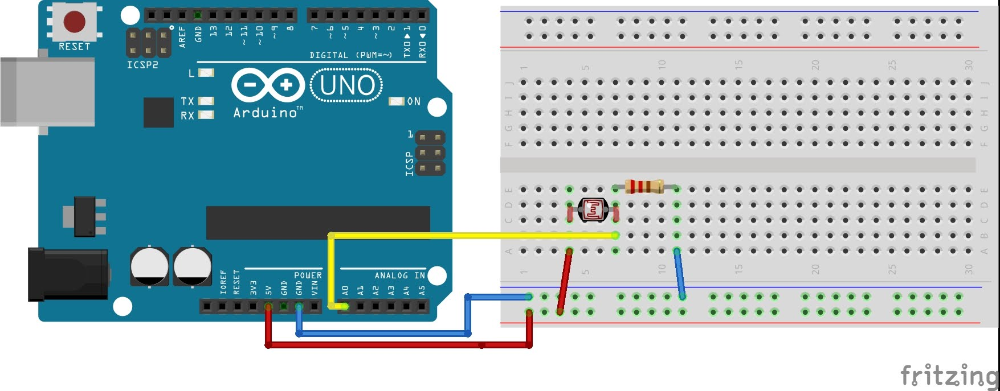

# 9.照度センサー

## センサー

照度センサーは明るさを検知します。


ここではCDSセルという照度センサーを使用します。
<br>
http://akizukidenshi.com/catalog/g/gI-00110/

このセンサーは暗くなると抵抗があがり、明るくなると抵抗が下がります。

## 回路




## スケッチ

```
int pin    = 0;  //センサーのピン番号
int get_a0 = 0;  //センサーデータ取得用

void setup(){
  Serial.begin(38400);
}

void loop()                     
{
  get_a0 = analogRead(pin);  // 照度センサーからデータを取得
  Serial.println(get_a0);    // シリアルモニタに出力
  delay(200);
}
```

入力が終わったらボードに書込みます。。

## 動作確認

シリアルモニタを開き、センサーに対して光を遮ったり、光をあてて数値に変化があることを確認しましょう。
<br>
